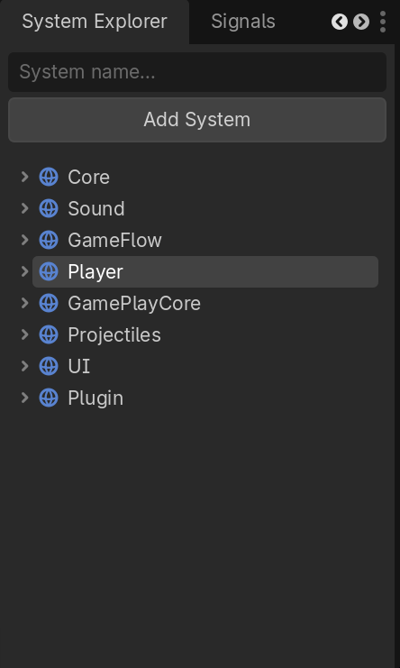
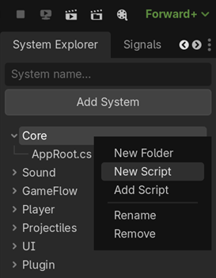
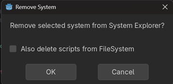

# System Explorer


System Explorer is a Godot C# editor plugin that provides an architecture-focused view of your project.

Instead of navigating large projects through the FileSystem dock, you can organize scripts into custom systems and folders that reflect the architecture of your game.

---

# Why?

Large C# projects often end up with deep folder structures:

```text
Game
└── Gameplay
    └── Entities
        └── Player
            └── Modules
```

While this works well for storing files, it can become cumbersome when navigating architecture.

System Explorer lets you create a higher-level view:

```text
Core
GameFlow
Sound
Player
UI
```

making it easier to jump between systems and understand project structure.

Rather than organizing code by where files happen to live on disk, System Explorer allows you to organize code according to how your game is actually structured.

---

# Features

## Architecture-Focused Navigation

Create custom top-level systems that represent the architecture of your game.

Example:

```text
Core
Sound
GameFlow
Player
UI
```

This makes it easy to navigate large projects from an architectural perspective instead of relying solely on the FileSystem dock.

---

## Systems

Supports:

* Create systems
* Rename systems
* Delete systems
* Reorder systems using drag & drop

Example:

```text
AppRoot
Sound
GameFlow
Player
UI
```

Useful for mirroring initialization order, application flow, or major game systems.

---

## Folders

Supports:

* Create folders
* Rename folders
* Delete folders
* Reorder folders using drag & drop

Example:

```text
Player
├── Composition
├── Coordination
└── Modules
```

Folders are virtual organization layers inside System Explorer and do not require changes to your physical folder structure.

---

## Scripts

Supports:

* Add existing scripts
* Create new scripts
* Rename scripts
* Remove scripts from System Explorer
* Remove scripts from System Explorer + Delete from FileSystem
* Reorder scripts using drag & drop

Selecting a script opens it in your configured script editor.

---

## Create New Scripts

Create new scripts directly from the plugin.

New scripts are:

* Created in the Godot FileSystem
* Automatically added to the System Explorer tree
* Generated using customizable script templates

---

## Script Templates

New scripts are generated using:

```text
addons/system_explorer/script_template.txt
```

You can customize this template to match your coding style, namespaces, project structure, or preferred class layout.

The placeholder:

```text
{{CLASS_NAME}}
```

is automatically replaced with the script file name.

Example:

```csharp
using Godot;

namespace MyNamespace
{
	public sealed class {{CLASS_NAME}}
	{

	}
}
```

If no template file is found, System Explorer falls back to a built-in default template.

---

## Drag & Drop Organization



Supports drag & drop reordering for:

* Systems
* Folders
* Scripts

Reorder systems, folders, and scripts directly in the tree view using drag & drop.

This makes it easy to keep architecture and script flow organized without manually editing configuration files.

---

## Expansion State Persistence

System Explorer remembers which systems and folders are expanded.

Expansion state is preserved when:

* Rebuilding the tree
* Creating scripts
* Creating folders
* Renaming systems
* Renaming folders

---

## Quick Navigation

### Shift + Click

Hold:

```text
Shift
```

and click a system or folder to quickly expand or collapse it.

While Shift is held, drag & drop is temporarily disabled to prevent accidental reordering.

---

## Context Menus


Right-click systems, folders, and scripts for quick actions.

Examples include:

* Add Folder
* Add Script
* New Script
* Rename
* Remove

---

## Removal Options

System Explorer separates architecture organization from file management.

When removing content you can choose between:

### Remove From System Explorer


Removes the item from the System Explorer tree while keeping all files intact in your Godot project.

Useful when reorganizing architecture views without affecting the actual project files.

### Remove From System Explorer + Delete From FileSystem

Removes the item from the System Explorer tree and permanently deletes the associated script files from disk.

This can be performed for:

* Individual scripts
* Entire folders
* Entire systems

A confirmation dialog and checkbox are provided before files are permanently removed.

This makes it possible to use System Explorer both as an architecture view and as a lightweight script management tool.

---

# Installation

1. Copy the addon into:

```text
addons/system_explorer/
```

2. Open the project in Godot.

3. Make sure the project contains a C# solution/project file.

If the project has not been initialized for C#, create one via:

```text
Project
→ Tools
→ C#
→ Create C# Solution
```

4. Build the C# project.

5. Enable the plugin:

```text
Project
→ Project Settings
→ Plugins
```

6. Enable System Explorer.

> **Note:** System Explorer is designed for C# projects. A valid Godot C# solution/project file must exist before the plugin can be compiled and used.

---

# Data Storage

System Explorer stores its structure in:

```text
addons/system_explorer/systems.json
```

This file can safely be committed to source control.

---

# Known Editor Behavior

When deleting scripts that were recently opened in the Godot script editor, Godot may occasionally display errors similar to:

```text
Cannot open file 'res://Example.cs'
Failed loading resource
```

These messages originate from Godot's internal editor cache attempting to reload a script that no longer exists.

This does not affect plugin functionality and typically disappears after rebuilding or reopening the project.

## Rare Script Creation Issue

In rare cases, when creating a new script from System Explorer, the script file may be created successfully in the Godot FileSystem but not automatically added to the System Explorer tree.

This issue has been difficult to reproduce consistently and is planned to be investigated further in a future update.

If this happens, restarting Godot usually resolves the issue.

If you are able to reproduce this problem or notice a pattern in when it occurs, bug reports with reproduction steps are greatly appreciated.

---
# Future Ideas

* Beautify individual scripts
* Beautify folders
* Beautify systems
* Custom icons
* Multiple architecture views
* Advanced search
* Namespace generation helpers

---

# Notes

System Explorer is not intended to replace Godot's FileSystem dock.

The goal is to provide a higher-level architectural view of your project, making it easier to navigate large C# codebases and organize systems according to how the game is structured rather than how files are stored on disk.

## Final Notes

System Explorer has reached a point where I feel it has a strong foundation and covers the functionality I originally set out to build.

Future updates may happen when needed, but my primary focus is currently my own game project.

Feedback, suggestions, bug reports, and feature requests are always welcome and appreciated.
