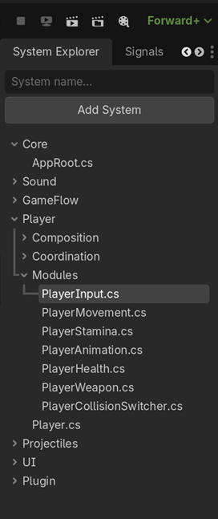

> 🚧 Preparing for release.
>
> Documentation and screenshots are currently being updated for the 1.1.1 release.


<p align="center">
	<a href="https://github.com/FootClanSoldier/SystemExplorer">
  
	</a>
</p>

<h1 align="center">System Explorer</h1>

<p align="center">
  <a href="https://godotengine.org/">
    
  </a>

  <a href="#about">
    
  </a>

  <a href="https://github.com/FootClanSoldier/SystemExplorer/releases">
    
  </a>

  <a href="./LICENSE">
    
  </a>
</p>

> Architecture-focused navigation plugin for Godot C# projects.
---

# About
System Explorer is a Godot C# editor plugin that provides an architecture-focused view of your project.

Instead of navigating large projects through the FileSystem dock, you can organize scripts into custom systems and folders that reflect the architecture of your game.

<p align="center">
  
</p>

---

# Why?

Large C# projects often end up with deep folder structures:

```text
Game
└── Gameplay
    └── Entities
        └── Player
            └── Modules
```

While this works well for storing files, it can become cumbersome when navigating architecture.

System Explorer lets you create a higher-level view:

```text
Core
GameFlow
Sound
Player
UI
```

making it easier to jump between systems and understand project structure.

Rather than organizing code by where files happen to live on disk, System Explorer allows you to organize code according to how your game is actually structured.

---

# Features

System Explorer is designed to provide an architecture-focused view of large Godot C# projects.

Instead of navigating deep folder structures through the FileSystem dock, you can organize scripts into systems and folders that reflect how your game is actually structured.

---

## Organization


System Explorer supports:

* Create systems
* Create folders
* Add existing scripts
* Create new scripts
* Rename items
* Remove items
* Drag & drop organization

Systems and folders are virtual organization layers and do not require changes to your physical project structure.

---

## Navigation

Navigate your project from an architectural perspective rather than relying solely on file locations.

Features include:

* Architecture-focused project navigation
* Quick script access
* Open File Path
* Reopen already selected scripts
* Expansion state persistence

This makes it easier to move between major systems such as:

```text
Core
GameFlow
Sound
Player
UI
```

without navigating through deep directory trees.

---

## Scene Integration

Connect C# architecture directly to the Godot scenes that use those scripts.

Features include:

* Link scripts to scenes
* Unlink scene associations
* Open linked scenes directly
* Scene recovery support if scenes are moved or deleted

Double-clicking a linked script automatically opens both the script and its associated scene.

Scene links are stored in `systems.json` and persist between editor sessions.

---

## Workflow Improvements
Several quality-of-life features help speed up common workflows:

* Script templates
* Script tooltips
* Context menus
* Keyboard shortcuts
* Expansion state persistence

### Keyboard Workflow

Several dialogs and input fields support confirming actions by pressing **Enter**.

This currently applies to:

* Rename dialogs
* Delete confirmation dialogs
* Create Folder dialogs
* Add System input field

When entering a new system name, pressing **Enter** performs the same action as clicking the **Add System** button.

### Quick Navigation

* **Shift + Click** a system or folder to instantly expand or collapse its contents.
* **Shift + Delete** opens the delete dialog for the selected item.
* Expansion state is automatically remembered between common operations.

### Context Menus

Right-click systems, folders, and scripts for quick actions.

Available actions include:

* New Folder
* New Script
* Add Script
* Link to Scene
* Unlink from Scene
* Rename
* Remove
* Open File Path

These workflow improvements help reduce unnecessary mouse movement and make navigating larger projects faster.

---

# Installation

1. Copy the addon into:

```text
addons/system_explorer/
```

2. Open the project in Godot.

3. Make sure the project contains a C# solution/project file.

If the project has not been initialized for C#, create one via:

```text
Project
→ Tools
→ C#
→ Create C# Solution
```

4. Build the C# project.

5. Enable the plugin:

```text
Project
→ Project Settings
→ Plugins
```

6. Enable System Explorer.

> **Note:** System Explorer is designed for C# projects. A valid Godot C# solution/project file must exist before the plugin can be compiled and used.

---

## Script Templates

New scripts are generated using:

```text
addons/system_explorer/script_template.txt
```

You can customize this template to match your coding style, namespaces, project structure, or preferred class layout.

The placeholder:

```text
{{CLASS_NAME}}
```

is automatically replaced with the script file name.

Example:

```csharp
using Godot;

namespace MyNamespace
{
	public sealed class {{CLASS_NAME}}
	{

	}
}
```

If no template file is found, System Explorer falls back to a built-in default template.

---

# Data Storage

System Explorer stores its configuration in:

```text
addons/system_explorer/systems.json
```

This file can safely be committed to source control.

---

# Known Issues

## Godot Editor Cache Warnings

When deleting scripts from the filesystem through the plugin, Godot may occasionally display warnings related to scripts that no longer exist.

These warnings originate from Godot's internal editor cache and do not affect plugin functionality.

They typically disappear after rebuilding or reopening the project.

---

# Future Ideas

* Custom icons
* Multiple architecture views
* Advanced search
* Namespace generation helpers
* Beautify systems
* Beautify folders
* Beautify scripts

---

# Notes

System Explorer is not intended to replace Godot's FileSystem dock.

The goal is to provide a higher-level architectural view of your project, making it easier to navigate large C# codebases and organize systems according to how the game is structured rather than how files are stored on disk.

For more detailed usage information and future advanced features, dedicated documentation may be added separately from the README.

---

# Feedback

System Explorer has reached a point where it provides a solid foundation for navigating and organizing larger Godot C# projects.
Future updates will primarily be driven by real-world usage, bug reports, and community feedback.

Feedback, suggestions, bug reports, and feature requests are always welcome and appreciated.

