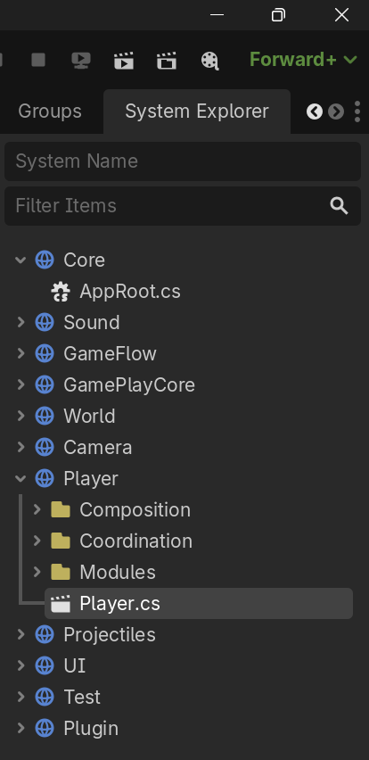
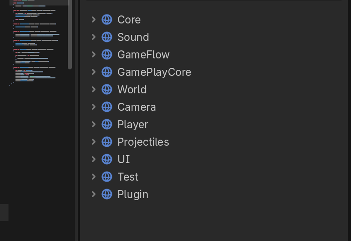
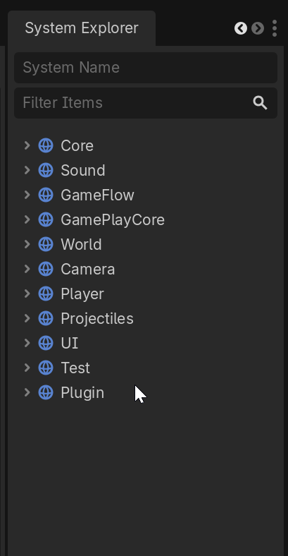
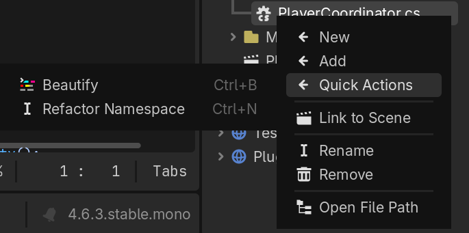
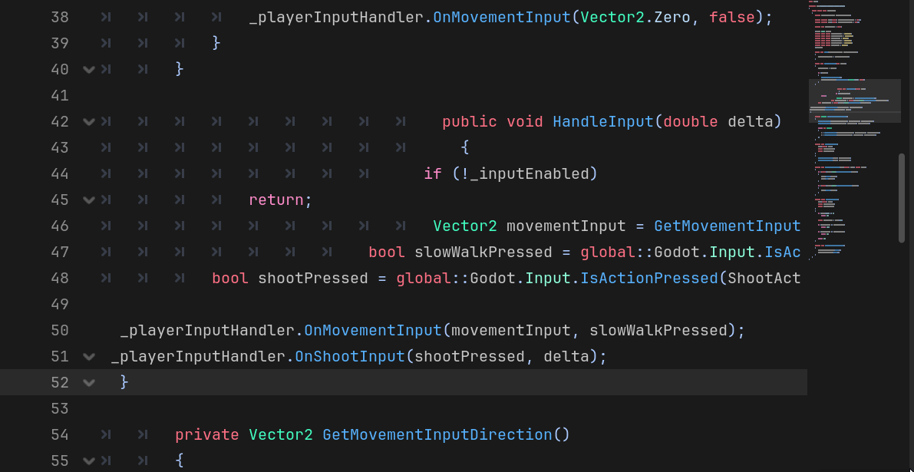
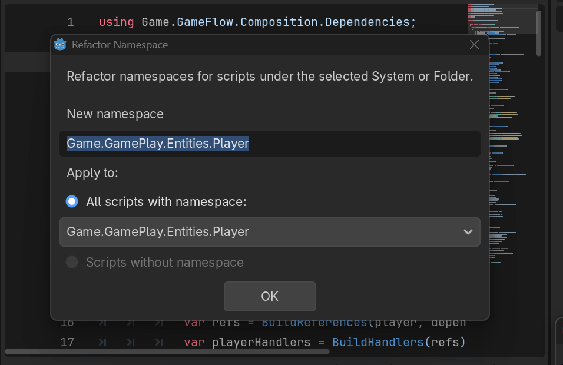

> [!NOTE]
> **Work in progress:** This README is currently being updated for the upcoming System Explorer v1.5.0 release. Some content may change before the release is published.

<p align="center">
  <a href="https://github.com/FootClanSoldier/SystemExplorer">
    
  </a>
</p>

<h1 align="center">System Explorer</h1>

<p align="center">
  <a href="https://godotengine.org/">
    
  </a>

  <a href="#about">
    
  </a>

  <a href="https://github.com/FootClanSoldier/SystemExplorer/releases">
    
  </a>

  <a href="./LICENSE">
    
  </a>
</p>

> Architecture-focused navigation and lightweight C# workflow tools for Godot.
>
> Evolving toward a lightweight C# IDE inside Godot.

---

<p align="center">
  <a href="#contents">
    
  </a>
</p>

<details>
  <summary><strong>▶ See System Explorer in action</strong></summary>

  <br>

  <p align="center">
    
  </p>

  <p align="center">
    <em>Organize items with drag and drop, and access file operations, scene linking, and optional Quick Actions from the tree context menu.</em>
  </p>

  <br>

  <p align="center">
    
  </p>

  <p align="center">
    <em>Navigate the tree and input fields without leaving the keyboard.</em>
  </p>

  <br>

  <p align="center">
    
  </p>

  <p align="center">
    <em>Quick Actions provide C# formatting and namespace refactoring inside Godot.</em>
  </p>
  
<br>

  <p align="center">
  
</p>

<p align="center">
  <em>Beautify reformats valid C# code directly inside Godot using CSharpier.</em>
</p>

<br>

<p align="center">
  
</p>

<p align="center">
  <em>Refactor Namespace updates the namespaces of scripts under the selected system or folder and also updates other scripts whose <code>using</code> directives reference them.</em>
</p>

</details>

<a id="contents"></a>

## Contents

* [About](#about)
* [Why?](#why)
* [Features](#features)
* [Keyboard Workflow and Shortcuts](#keyboard-workflow-and-shortcuts)
* [Quick Actions](#quick-actions)
* [Installation](#installation)
* [Script Templates](#script-templates)
* [Data Storage](#data-storage)
* [Roadmap](#roadmap)
* [Feedback](#feedback)

<a id="about"></a>

# About

System Explorer is a Godot 4.6 C# editor plugin that lets you organize and navigate a project from an architectural perspective instead of relying solely on the FileSystem dock.

Create systems and virtual folders, organize scripts and scenes, connect scripts to the scenes that use them, and navigate a large codebase without forcing the System Explorer hierarchy to match the physical project structure.

System Explorer also includes optional lightweight C# workflow tools such as script formatting and namespace refactoring directly inside the Godot editor.

---

<a id="why"></a>

# Why?

Large C# projects often end up with deep physical folder structures:

```text
Game
└── Gameplay
    └── Entities
        └── Player
            └── Modules
```

System Explorer provides a separate architectural view:

```text
Core
GameFlow
Sound
Player
UI
```

The same script or scene can appear where it is architecturally useful without moving the physical file or duplicating the underlying resource.

Organize the project around how its systems relate to each other, not only where files happen to live on disk.

---

<a id="features"></a>

# Features

## Architecture and Organization

* Create systems and virtual folders
* Create new C# scripts or add existing scripts
* Add multiple scripts or scenes in one operation
* Place the same script or scene in multiple locations
* Reorder and organize systems, folders, scripts, and scenes with drag and drop
* Lock or unlock systems, folders, scripts, and scenes with the middle mouse button to prevent accidental drag-and-drop changes
* Rename systems, folders, scripts, and scenes through the tree
* Remove entries virtually or explicitly delete their physical script and scene files
* Keep the System Explorer hierarchy independent of the physical project structure

<a id="context-menu"></a>
<p align="center">
  <a href="#context-menu">
    
  </a>
</p>

<p align="center">
  <em>Most organization and file operations are available directly from the tree context menu.</em>
</p>

## Path-Bound Folders

Virtual folders can optionally be bound to physical folders inside the Godot project.

A bound folder follows supported scripts and scenes in its linked project directory while the rest of the System Explorer hierarchy remains virtual. This makes it possible to mirror only the parts of the physical project structure that are useful to the architecture view.

Folder bindings can be added or removed from the folder context menu. Bound folder data is stored separately from the main systems data.

## Navigation

* Filter scripts and scenes across every system
* Open scripts and direct scene entries with a single click
* Double-click a script to open its linked scene
* Follow scripts opened through System Explorer, Godot's Script Editor, the FileSystem dock, or scenes
* Open resolved script, scene, and folder paths in the operating system's file manager
* Navigate the tree with the arrow keys
* Move between the tree, Filter Items, and System Name without leaving the keyboard
* Preserve expansion state and the exact selected tree occurrence between editor sessions
* Recover the plugin's editor integration after C# assembly reloads

  <p align="center">
  <a href="#contents">
    
  </a>
<p/>


## Scene Integration

Connect scripts directly to the scenes that use them.

* Link a script to a scene
* Add standalone scene entries to systems and folders
* Open a script or scene directly from the tree
* Double-click a script to open its linked scene
* Relink or remove missing script and scene references
* Preserve scene associations when scripts are duplicated or renamed
* Update direct scene entries and linked-script references when a scene is renamed through System Explorer

The same script or scene can appear in multiple systems or folders while still referring to the same physical resource.

## Reliable File and Metadata Operations

System Explorer performs validation before operations that affect project files or plugin metadata.

* Validates rename, removal, linking, and drag-and-drop operations before applying changes
* Handles open and unsaved C# editor buffers carefully
* Supports case-only renames
* Handles scripts and scenes located directly in the project root
* Keeps duplicate entries and linked-scene references synchronized
* Verifies metadata writes and attempts rollback when an operation cannot be completed
* Displays clear dialogs when an operation cannot be performed safely
* Restores shortcuts, signals, tree state, and editor integration after C# assembly reloads

Longer foreground batch operations display a busy cursor to indicate that System Explorer is still processing the operation.

---

<a id="keyboard-workflow-and-shortcuts"></a>

# Keyboard Workflow and Shortcuts

Configurable Godot editor shortcuts and arrow-key navigation.

Shortcuts are registered under:

```text
Editor Settings → Shortcuts → System Explorer
```

They can be changed or unbound through Godot's normal shortcut settings. System Explorer also detects when the same shortcut has been assigned to multiple plugin commands and prevents an ambiguous command from running.

| Default shortcut | Action | Context |
|---|---|---|
| `Ctrl+B` | Beautify | System Explorer or Script Editor |
| `Ctrl+S` | New Script | Selected tree item |
| `Delete` | Remove Selected Item | Selected tree item |
| Physical key before `1` | Toggle Tree / Script Editor Focus | System Explorer or Script Editor |
| `Ctrl+T` | Collapse Tree | Selected tree item |
| `Ctrl+R` | Rename | Selected tree item |
| `Ctrl+F` | New Folder | Selected tree item |
| `Ctrl+Alt+S` | Add Scripts | Selected tree item |
| `Ctrl+Alt+A` | Add Scenes | Selected tree item |
| `Ctrl+N` | Refactor Namespace | Selected tree item |

The displayed symbol for the focus-toggle key varies by keyboard layout because the shortcut uses the physical key position before `1`.

Except for **Beautify** and **Toggle Tree / Script Editor Focus**, shortcuts are scoped to System Explorer and require a compatible selected tree item.

## Keyboard-First Navigation

Arrow keys can move through visible tree entries, expand or collapse branches, and move between the tree and the input fields above it.

Press `Esc` while editing **System Name** to clear the field. In **Filter Items**, `Esc` clears the active filter while keeping the keyboard workflow inside the filter context.

**Toggle Tree / Script Editor Focus** is designed to make a mostly keyboard-driven workflow possible. After selecting and opening a script from System Explorer, the command moves keyboard focus into the active script editor. Pressing it again returns focus to System Explorer and restores the previous tree or input-field context where possible.

The focus transition is functional, although its visual indication is still subtle. Clearer focus feedback is planned for a future release.

---

<a id="quick-actions"></a>

# Quick Actions

Quick Actions are optional and disabled by default.

They can be enabled in Godot under:

```text
Project
→ Project Settings
→ General
→ Addons
→ System Explorer
→ Enable Quick Actions
```

When enabled, Quick Actions add lightweight C# tools to the System Explorer context menu and shortcut workflow.

<a id="#quick-actions"></a>
<p align="center">
  <a href="#quick-actions">
    
  </a>
<p/>

## Beautify

System Explorer integrates with the open-source [CSharpier](https://github.com/belav/csharpier) formatter.

* Format the active C# script from Godot's Script Editor
* Format an individual script selected in System Explorer
* Format all scripts inside a selected folder or system
* Install CSharpier through the prompt shown by System Explorer when it is unavailable
* Preserve relevant editor focus, caret, scroll, and active-script state during formatting where possible

Use `Ctrl+B` from either System Explorer or the active C# Script Editor when Quick Actions are enabled.

> **Note:** The script must contain valid C# syntax. Beautify cannot format a script that CSharpier is unable to parse.

## Refactor Namespace

Namespace refactoring can be run for a selected script, folder, or system.

It can add or replace namespaces and update related references across the selected scope while protecting open editor buffers and reporting files that could not be updated.

Because namespace refactoring may affect multiple project files, reviewing the result before committing changes is recommended.

---

<a id="installation"></a>

# Installation

System Explorer is designed for Godot 4.6 .NET/C# projects.

1. Copy the addon into:

```text
addons/system_explorer/
```

2. Open the project in the .NET version of Godot.

3. Make sure the project contains a C# solution and project file.

If the project has not yet been initialized for C#, create the solution through:

```text
Project
→ Tools
→ C#
→ Create C# Solution
```

4. Build the C# project.

5. Open:

```text
Project
→ Project Settings
→ Plugins
```

6. Enable **System Explorer**.

> System Explorer cannot be compiled or used in a project that has not been initialized for C#.

---

<a id="script-templates"></a>

# Script Templates

New scripts are generated from:

```text
addons/system_explorer/Resources/script_template.txt
```

The template can be customized to match your preferred namespaces, coding style, and class layout.

The placeholder:

```text
{{CLASS_NAME}}
```

is replaced with the new script's file name.

Example:

```csharp
using Godot;

namespace MyNamespace
{
    public sealed class {{CLASS_NAME}}
    {

    }
}
```

If the template file does not exist, System Explorer uses a built-in default template.

---

<a id="data-storage"></a>

# Data Storage

System Explorer stores its architecture data in:

```text
addons/system_explorer/Resources/systems.json
```

This includes systems, virtual folders, scripts, scenes, linked-scene associations, ordering, and lock states.

Physical folder bindings are stored separately in:

```text
addons/system_explorer/Resources/folder_bindings.json
```

Both files can be committed to source control when the architecture view and folder bindings should be shared with the project.

Local tree expansion and selection state is stored in:

```text
res://.godot/system_explorer/tree_state.json
```

This is local editor state inside Godot's generated `.godot` directory and is not intended for source control.

---

<a id="roadmap"></a>

# Roadmap

Possible future additions include:

* Lightweight C# autocomplete suggestions in Godot's Script Editor
* Clearer visual feedback when focus moves between System Explorer and the Script Editor
* System notes and TODO descriptions
* Multiple architecture views
* Additional C# workflow and refactoring tools
* Faster navigation between scripts and the scenes that use them

Roadmap items are ideas rather than guaranteed release commitments.

---

<a id="feedback"></a>

# Feedback

Feedback, suggestions, bug reports, and feature requests are welcome.

Future development will primarily be guided by real-world usage and community feedback.
